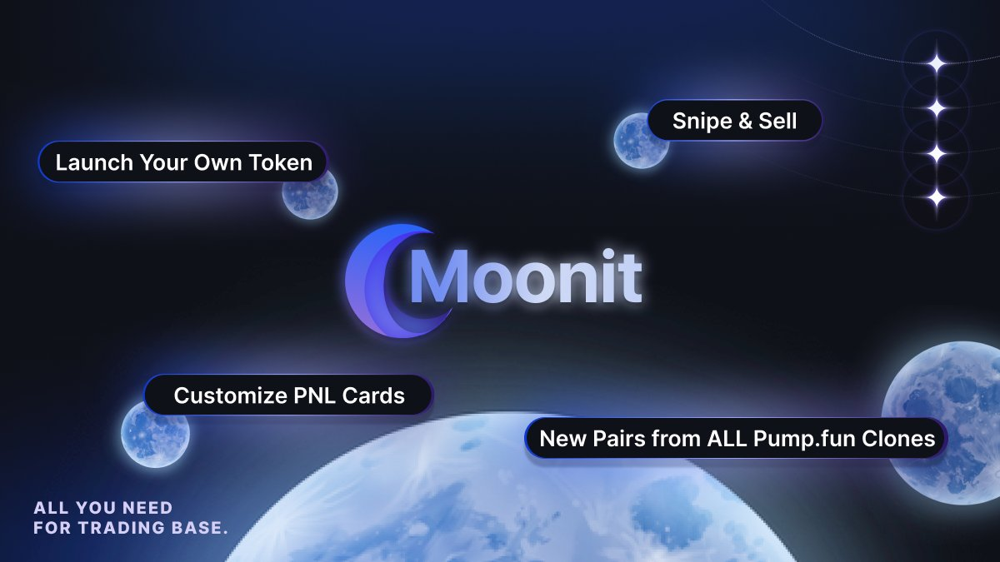

# What is Moonit?

<figure><figcaption></figcaption></figure>

## Introduction

Welcome to Moonit - the ultimate trading platform on Base built for traders by traders. It is the 1st DEX Trading Platform on Base with a token launchpad, aiming to resolve market conditions and trading friction on Base. A true all in one solution for Base:

🌙 DEX trading terminal

🌙 Token launching

🌙 Rev Share via Token and Airdrop Claims via Staking

🌙 UIUX experience made by traders

Coming soon:

🌙 Snipe and sell features

🌙 New pairs scanner for all Base pumpfun-clones

🌙 Meme Coin ETFs via Hyperliquid Vaults

🌙 AI sentiment analysis for memes

## Ethos

On July 6th, the market had retraced to a local all time low (BTC under 57k) and alongside it plummeted onchain trading. Whether or not the public perceived this decline as a bottom, it is a no brainer that the market is due to rebound and surpass ATH by the end of Q4 with elections to happen, ETH ETF to be priced in, and market/stocks to close out the year. With this, onchain Solana activity will most obviously return, but one overlooked market by retail and general builders is the rise of onchain activity on a chain known as Base.&#x20;

In March/April 2024, we saw the rise of Base meme coin volume, flipping that of Solana’s even. This was the time of $BRETT, $MFERS, $DEGEN , "BASED \_\_\_" tokens coming everyday. This euphoria of Base has been seen before and it is of our highest conviction to theorize that Base will become a winner in the onchain space once again.

What incentives and alignments drive us towards this vision?

1. Coinbase is migrating economic activity onchain onto Base.
2. There is finally a representative coin for Base - $MIGGLES. ETH has $PEPE and $MOG while Solana has $WIF, $BONK, $BOME.
3. Base is a retail driven ecosystem and if we were to discuss Alt L2's in this current cycle (which already are not too popular), it is objectively difficult for Base to lose the crown to Polygon or Arbitrum or Camp L2.
4. Coinbase Wallet and Coinbase listings of the Base Network are possibilities of the #1 CEX in the United States backing this chain.

## Saving Base

It is clear to us that Base is setup for success in the space, so what's left? All we need is the infrastructure, trader interests, and attention to bring us back to #Base Valhalla.

This is exactly what Moonit will do:

* Infrastructure: A native Photon/Bullx optimized for Base and their sequencer.
* Trader Interest: Curated launches consistently to bring back winners on Base.
* Attention: A new platform like Moonit and our KOLs and Base network.

Whether or not Apedotstore, Basedotjump, Photon, or other "competitors" perform well on Base, it is all the better for bringing our vision to fruition. Moonit will be the all in one infrastructure needed to unify all the toolings on Base for success.

Let's bring Base back to the moon 🚀
