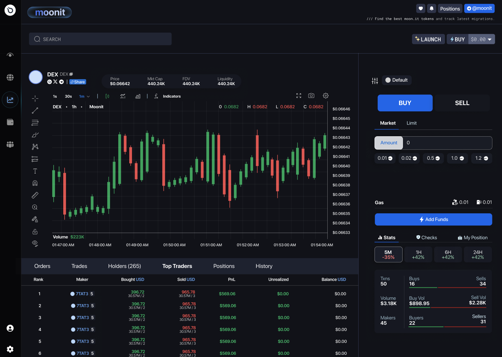

# DEX Trading Terminal

<figure><figcaption></figcaption></figure>

## Problem

For most pumpfun clones, the emphasis on UIUX is abysmal. The target focus of these protocols is securing the bonding curves and fortifying their backend, leaving behind a trail of issues regarding poor user experience. Out of a survey conducted by the Moonit team, we have found that 8/10 degen traders do not even use pumpfun to trade. When we take a look at the clones, it's a no wonder that they end up dying out as well!

<figure><figcaption></figcaption></figure>

## Solution

With the team comprising of veteran traders, we have employed a design to encapsulate the  low friction UIUX of a PERP trading platform, while including onchain analytics that we believe aid the most in trading meme coins. This includes holder distribution, top traders, holder charts, top traders, sniper buys, and more.
