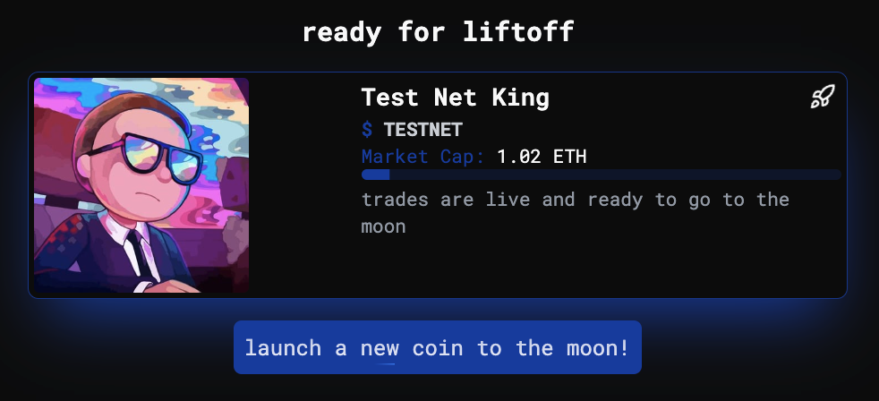

# First Time Users

**\[Updated as of August 8nd]**

**⚠️ The Moonit team will never ask for your private key or funds.**

#### Ready for Liftoff:

This section highlights tokens launched from [moon.it.com](https://moon.it.com/) that are trending and at least half way to bonding onto Uniswap. Aim to launch tokens that achieve 'ready for liftoff' status.

<figure><figcaption></figcaption></figure>

#### Advanced Token Filters

While screening for new pairs, filter by creation date, market cap, name, socials, or recent activity to have a better trading experience when looking for tokens to ape into.

<figure><figcaption></figcaption></figure>

#### Buy and Sell on Moonit Bonding Curves

Utilize our advanced trading terminal to buy, sell, tweak slippage, and add token to your wallet for any moonit token on the platform. You can realize profits (or losses 😭)  at any time during the moonit bonding curve, or be a chad and HODL your way through to uniswap and then the moon!

<figure><figcaption></figcaption></figure>

#### Ready for Liftoff Progress

For every token launched on the moonit platform, there will be a 'liftoff progress' and 'ready for liftoff progress' bar to measure just how _based_ your token is. When enough people ape into a token, liquidity in our bonding curve will be deposited to a live Uniswap pool and lp tokens will be burned. Our current bonding curve caps at 17 $ETH.

<figure><figcaption></figcaption></figure>

#### Connect Wallet

That's about it mooners! Now let's get started with your journey to make it out the trenches. If you don't have a wallet, select Coinbase and make a smart wallet. Once you are connected, you will be able to view your profile in the dropdown.

<figure><figcaption></figcaption></figure>
